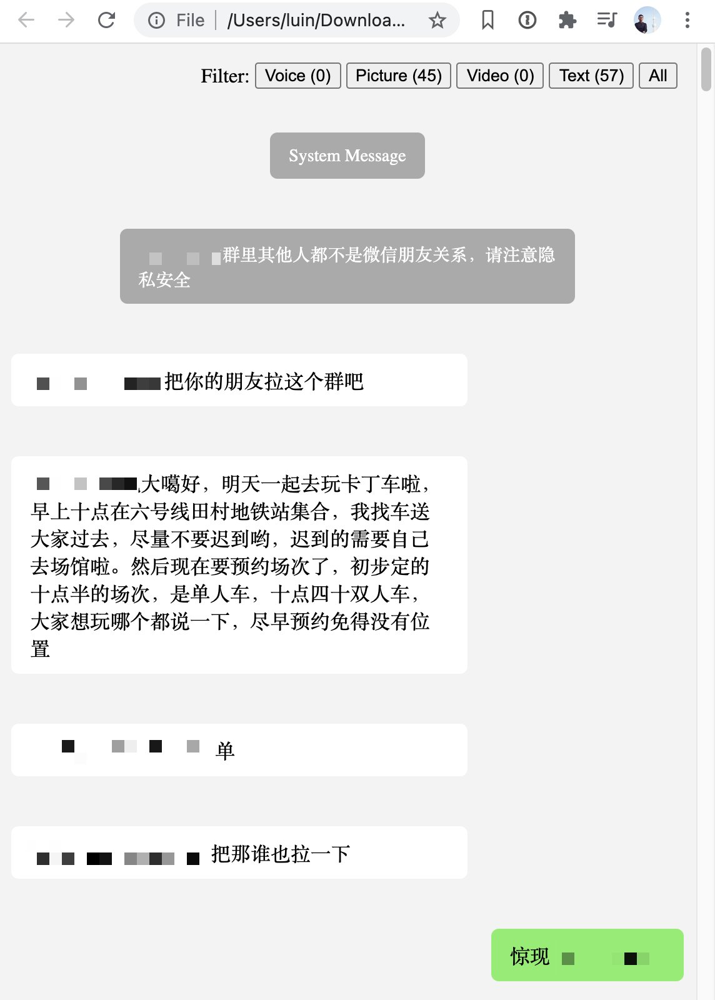
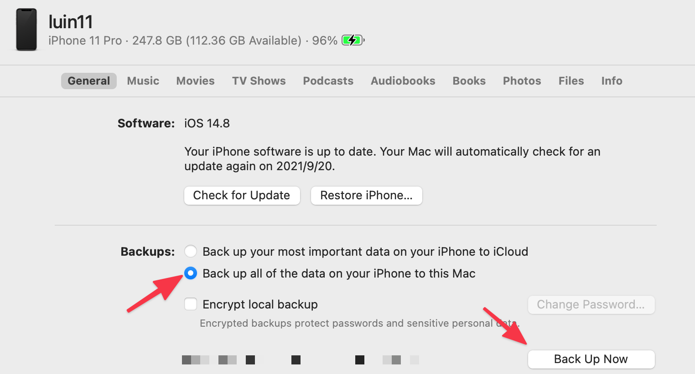
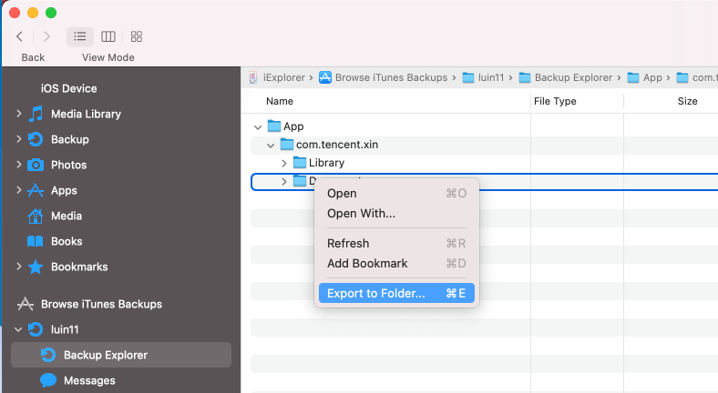

# wechat-export

Export WeChat chat histories to HTML files.

## Preview

## How to Use

0. Back up iPhone with your Mac.

    

0. Use [iExplore](https://macroplant.com/iexplorer) to export "Documents" to the local system.

    

0. Clone the code.
0. Compile the [audio decoder](https://github.com/kn007/silk-v3-decoder): `cd silk/silk && make && cd ../../`
0. `npm install`
0. `node index.js path_to/Documents output_dir`

## Articles

* [iOS 微信的本地存储结构简析](https://zhuanlan.zhihu.com/p/22474033)

## Related Projects

* [WeChatExporter](https://github.com/tsycnh/WeChatExporter)
* [WechatExport-iOS](https://github.com/stomakun/WechatExport-iOS)

## Credits

Silk decoder is developed by [Karl Chen](https://github.com/kn007/silk-v3-decoder).
